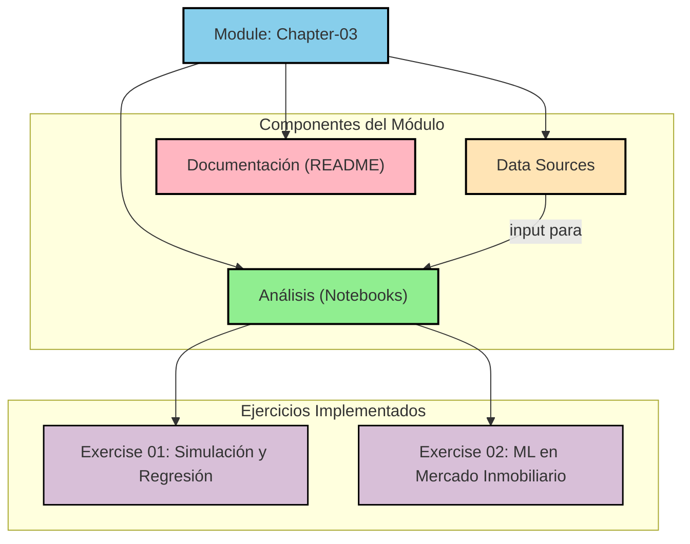

# Módulo: Capítulo 3 - Algoritmos y Modelos

## Descripción

Este módulo se enfoca en la implementación práctica de algoritmos de Machine Learning fundamentales, tal como se describe en el Capítulo 3 de *Doing Data Science*. Los ejercicios cubren desde la simulación de datos para validar modelos de regresión hasta la aplicación de técnicas de clasificación y la validación rigurosa de los resultados en datasets del mundo real.

## Arquitectura del Módulo

A continuación se presenta un diagrama de flujo que ilustra los componentes y dependencias dentro de este módulo.

---

## Contenido Detallado

### **Exercise 01: Simulación y Regresión Lineal**
- **Objetivo:** Validar los principios de la regresión lineal mediante la simulación de datos. Se busca demostrar cómo un modelo de Mínimos Cuadrados Ordinarios (OLS) puede recuperar los parámetros (`β`) verdaderos de un proceso generador de datos, y cómo el error (`MSE`) se ve afectado por el ruido y el tamaño de la muestra.
- **Tecnologías:** R, `dplyr`, `ggplot2`.
- **Notebook:** [`notebook/exercise-01-simulation-regression.Rmd`](./notebook/exercise-01-simulation-regression.Rmd)

### **Exercise 02: Algoritmos Básicos de ML (Mercado Inmobiliario de Manhattan)**
- **Objetivo:** Aplicar un flujo de trabajo de Machine Learning de extremo a extremo a un dataset real.
- **Metodología:**
    1.  **Regresión Lineal:** Se desarrollan modelos para predecir el precio de venta. Se demuestra cuantitativamente que la **ubicación (`NEIGHBORHOOD`)** es un predictor dominante, elevando el R² ajustado del modelo del **70.6% al 81.2%**. El modelo final se valida mediante diagnósticos de residuos.
    2.  **Clasificación (k-NN):** Se entrena un clasificador k-Nearest Neighbors para predecir el barrio de una propiedad basándose en sus características físicas. Se realiza una optimización de hiperparámetros, encontrando un `k` óptimo de 11 que resulta en una **precisión del 61.6%** en el conjunto de prueba.
- **Tecnologías:** R, `dplyr`, `ggplot2`, `broom`, `FNN`, `caret`.
- **Notebook:** [`notebook/exercise-02-ml-algorithms.Rmd`](./notebook/exercise-02-ml-algorithms.Rmd)

---